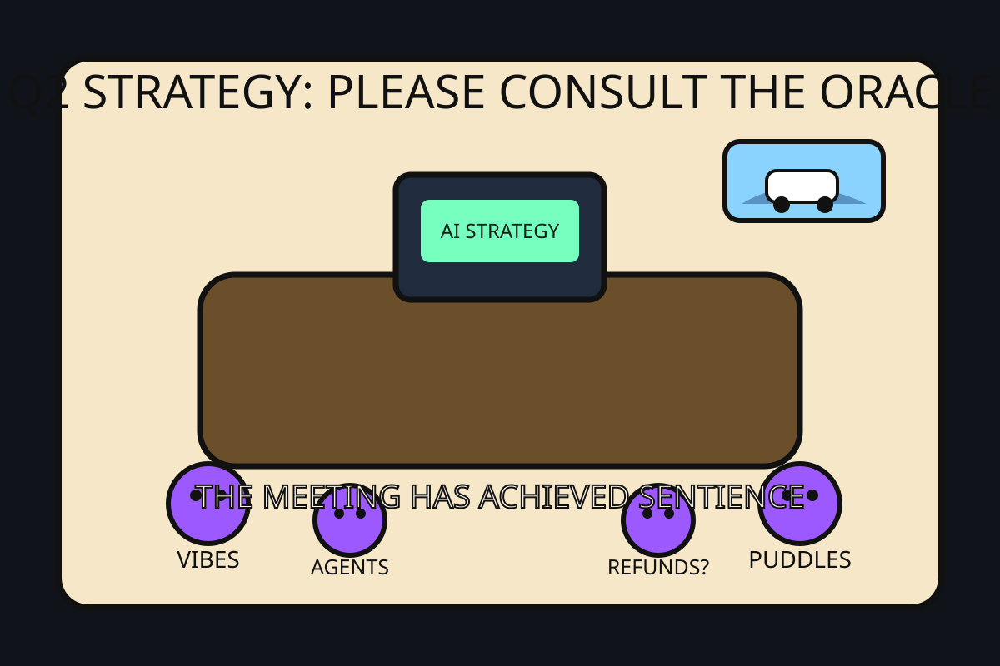

# The Mood of the Internet Today

_Date: 2026-05-15_

Today the internet believes:

- Every company has entered its haunted slide deck era: not quite AI transformation, not quite group hallucination, but definitely billable.
- Your storage layer wants you to learn how SSDs work before it agrees to remember anything.
- The future of transportation is a robotaxi confidently discovering the ancient technology of puddles.
- The family van is the last functioning superhero franchise.
- GitHub is now mostly people uploading “skills” so the robots can develop hobbies before replacing ours.

## Alternate Timeline Headlines

- **Board Approves New Chief Vibes Officer After Q3 Forecast Appears in a Dream**
- **California Considers Law Requiring Dead Online Games to Leave a Will**
- **Facial Recognition System Recognizes Protest, Immediately Asks to Speak to Legal**
- **Scientists Confirm Cheetah, Leopard, and Jaguar Spots Are Just Nature’s CAPTCHA**

## Market Prophecy

Bullish on agent frameworks, on-device voices, tiny personal superintelligences, vans, and anyone selling a PDF titled like a threat. Bearish on archives, standing water, and dashboards that can no longer explain why everyone is clapping.

## Sentiment Index

**73%** “we need an AI strategy”  
**14%** “the AI strategy needs a therapist”  
**8%** “please patch the game before deleting the universe”  
**5%** bull, saying “bruuuh” in a field somewhere

## Sources

- Reddit r/popular top daily RSS: bull reaction video, Toyota Sienna save, big cat spot taxonomy, iPhone debate, and late-night studying tableau — https://www.reddit.com/r/popular/top/.rss?t=day
- Hacker News front page RSS: “I believe there are entire companies right now under AI psychosis,” SSD writing, facial recognition at protest, online game shutdown patches/refunds, Waymo standing-water recall — https://hnrss.org/frontpage
- GitHub Trending: personal AI, agent skills, on-device TTS, WiFi spatial sensing, n8n MCP, and assorted robot toolbelts — https://github.com/trending
- Google Trends configured source was checked, but the public page did not expose usable daily query text in the fetched document — https://trends.google.com/trending?geo=US
